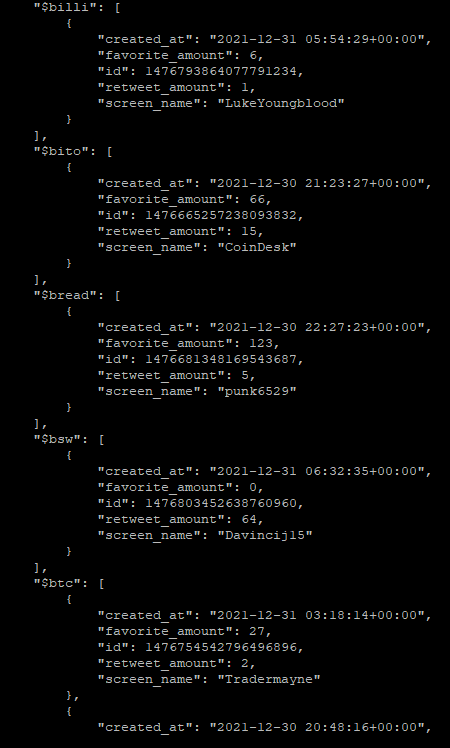

# Prequisites
- get python and tweepy
`pip install tweepy/ pip3 install tweepy`
- change the *cash_tag_path* variable to a desired output directory, keep the used syntax
- Optional. Put in twitter user names into the *ignores* array var to ignore their tweets.
- get twitter developer acc 
https://developer.twitter.com/
    1. Create a project -> app / standalone app on the twitter developer site
    2. Setup OAuth 1.0a under "User authentication settings" (callback url/ website url dont matter, just put in googles address)
    3. Retrieve the necessary auth keys under "Keys and tokens" and plug them into the script
- execute script frequently manually or.. 
    - (Linux) Execute the script cyclic in a cronjob so
        1. crontab -e
        2. paste cronjob syntax or create own schedule  
        https://crontab-generator.org/  
        `0 2,14 * * * /usr/bin/python3 PATHOFSCRIPT/grab.py`
        3. save with ESC -> :wq -> ENTER
    - (Windows) Do the same with the task scheduler. No instr. for that
- output is currently in the following json format  

## Nice to know
- currently the script fetches and checks a max amount of 200 tweets x 10 calls so 2000 tweets in a run. If your timeline
posts more than that change the execution frequency to something lower (api is limited to 45k retrivals in 15 mins i think) or change the amount of calls in the *call_amount* variable. 

## Todo
- catch errors
- Visualization via matplotlib/ instructions to put data into grafana
- likes/ retweets are only fetched once, you wont be able to make good statistics on that when you fetch really frequently because the values
will only represent their value in the cyclic time frame. to update all tweets in retrospective is prolly too much for the api when you r an active user
but maybe update only update tweets that are younger than a week or set the script execution frequency to a higher one (maybe 7 days) that atleast a good chunk
of the values are representative 