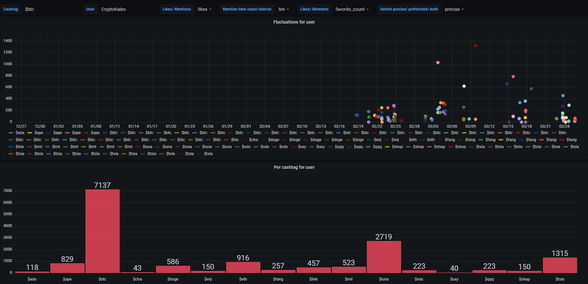
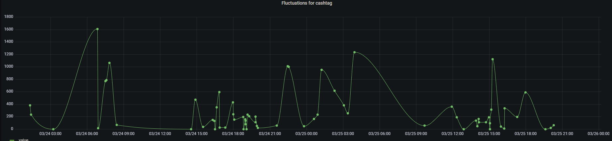
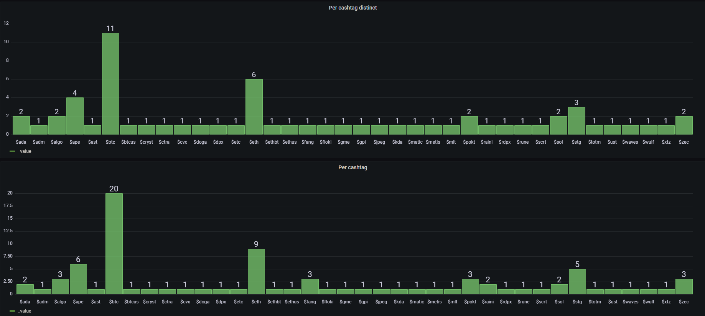

# What is this for
Im using my twitter feed to get informed about new trends in the crypto scene. This tool helps me to identify those without manually mindlessly scrolling through the feed and
trashing my brain in the process. It collects the necessary data and visualizes it in grafana.

# How does it work
It fetches your feed and searches for every so called 'cashtag' by using a regex that searches for '$XXX' or similar strings. In an extended search an extensive list of registered coins is fetched from coingecko which supplies strings to search for in tweets that might also identify coins. This allows to catch mentions of coins without the 'cashtag' syntax/ the dollar sign (phrases that are too common in the english language are subtracted). The visualization in grafana is aimed to be parameterizable to display different statistics about different properties like
how many
- *mentions*
- *retweets*
- *likes*

did a coin/cashtag get.

# Prequisites
- Docker + Docker compose
- get twitter developer acc 
https://developer.twitter.com/
    1. Create a project -> app / standalone app on the twitter developer site
    2. Setup OAuth 1.0a under "User authentication settings" (callback url/ website url dont matter, just put in googles address)
    3. Retrieve the necessary auth keys under "Keys and tokens" and *plug them into the python script* (consumer_key, consumer_secret, access_token, access_token_secret)
- Optional. Put in twitter user names into the *ignores* array var to ignore their tweets (useful to ignore bot accs).
- Optional. Put in a *public/ unlisted* pastebin url with cashtags you want to ignore in the *ignoreCashtagsPastebinUrl* variable. For the pastebin its the same syntax as shown in the "most_common_words" (folder).

# How to get it working
- do a *docker-compose up -d* in this directory and visit *localhost:3000*
- *hint*: you probably better keep this running on a server, if you dont already have some spare compute laying arround the oracle cloud overs a free vps with 1gb ram and some arm cpu thats enough to keep this alive. In addition i'd use the tailscale vpn service so you dont have to worry about open ports and malicious actors from the evil parts of the web.

# Example pictures

